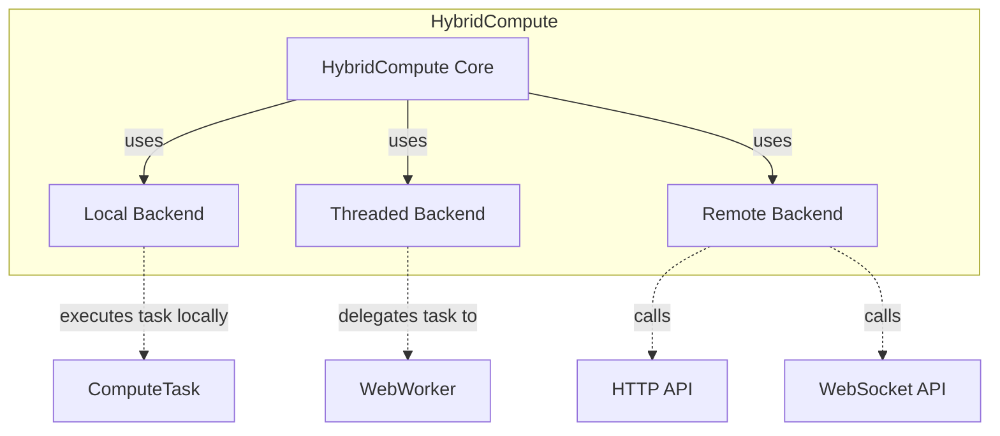
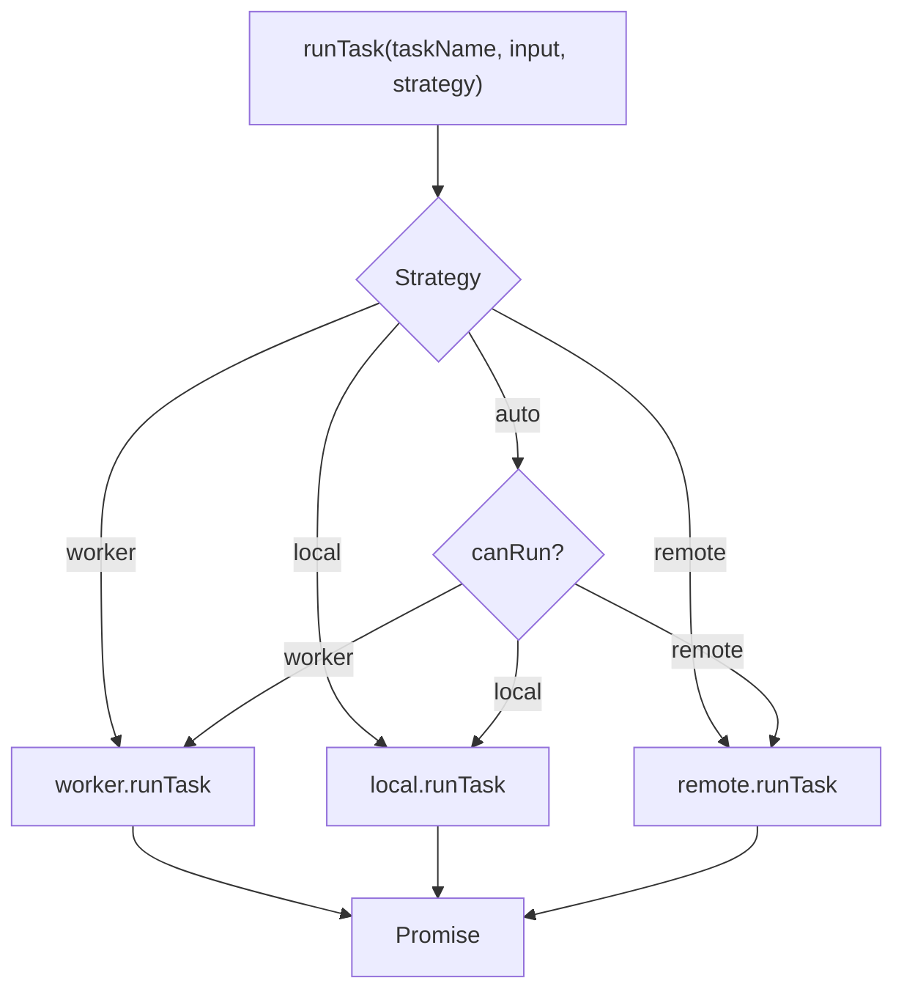
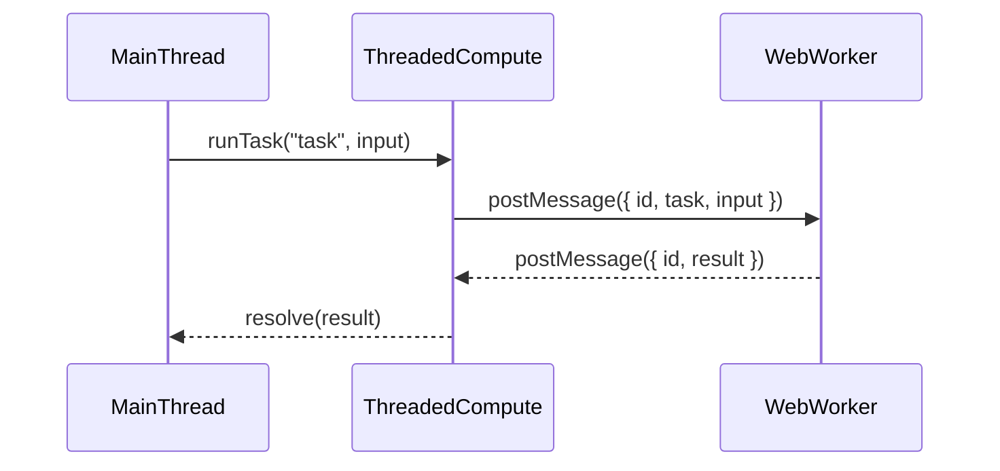
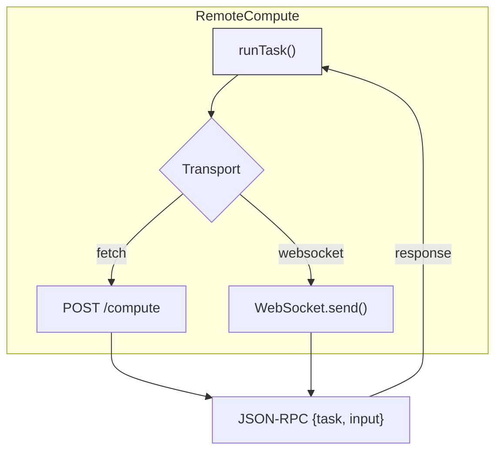

# @hybrid-compute

**Run compute tasks wherever they run best - local, threaded, or remote - with a
pluggable backend architecture.**

[](http://commitizen.github.io/cz-cli/)
[](http://makeapullrequest.com)
[](http://semver.org/spec/v2.0.0.html)


[](https://codecov.io/gh/phun-ky/hybrid-compute)
[](https://github.com/phun-ky/hybrid-compute/actions/workflows/check.yml)

## About

`@hybrid-compute` is a flexible, modular compute orchestration framework that
dispatches computational tasks to the most appropriate backend — whether that's:

- The local JS thread (for fast, simple tasks)
- A dedicated Web Worker (for multi-threaded offloading)
- Or a remote compute service over HTTP or WebSocket

All you do is define tasks and call `runTask()`. HybridCompute takes care of the
rest.

## Table of Contents<!-- omit from toc -->

- [@hybrid-compute](#hybrid-compute)
  - [About](#about)
  - [API](#api)
  - [Usage](#usage)
  - [Example](#example)
  - [Visual overviews](#visual-overviews)
    - [High-Level Package Architecture](#high-level-package-architecture)
    - [Task Dispatch Flow (HybridCompute Core)](#task-dispatch-flow-hybridcompute-core)
    - [Threaded Worker Lifecycle](#threaded-worker-lifecycle)
    - [Remote Compute Flow (WebSocket or Fetch)](#remote-compute-flow-websocket-or-fetch)
  - [Development](#development)
  - [Contributing](#contributing)
  - [License](#license)
  - [Changelog](#changelog)
  - [Sponsor me](#sponsor-me)

## API

Check out the full documentation
[here](https://github.com/phun-ky/hybrid-compute/blob/main/api/README.md).

Includes:

- All public classes and methods
- Task registration and execution patterns
- Transport and backend setup guides

## Usage

```shell-session
npm install @hybrid-compute/core
```

## Example

```ts
import {
  HybridCompute,
  createLocalCompute,
  createThreadedCompute,
  createRemoteCompute
} from '@hybrid-compute/core';

const compute = new HybridCompute({
  local: createLocalCompute(),
  worker: createThreadedCompute(new URL('./worker.js', import.meta.url), [
    'double'
  ]),
  remote: createRemoteCompute({ transport: 'fetch', endpoint: '/api/compute' })
});

const result = await compute.runTask<number, number>('double', 21, 'auto');
console.log(result); // 42
```

## Visual overviews

### High-Level Package Architecture



### Task Dispatch Flow (HybridCompute Core)



### Threaded Worker Lifecycle



### Remote Compute Flow (WebSocket or Fetch)



## Development

```shell-session
// Build
$ npm run build
// Test
$ npm test
```

## Contributing

Want to contribute? Please read the
[CONTRIBUTING.md](https://github.com/phun-ky/hybrid-compute/blob/main/CONTRIBUTING.md)
and
[CODE_OF_CONDUCT.md](https://github.com/phun-ky/hybrid-compute/blob/main/CODE_OF_CONDUCT.md)

## License

This project is licensed under the MIT License - see the
[LICENSE](https://github.com/phun-ky/hybrid-compute/blob/main/LICENSE) file for
details.

## Changelog

See the respective package changelogs.

## Sponsor me

I'm an Open Source evangelist, creating stuff that does not exist yet to help
get rid of secondary activities and to enhance systems already in place, be it
documentation, tools or web sites.

The sponsorship is an unique opportunity to alleviate more hours for me to
maintain my projects, create new ones and contribute to the large community
we're all part of :)

[Support me on GitHub Sponsors](https://github.com/sponsors/phun-ky).

p.s. **Ukraine is still under brutal Russian invasion. A lot of Ukrainian people
are hurt, without shelter and need help**. You can help in various ways, for
instance, directly helping refugees, spreading awareness, putting pressure on
your local government or companies. You can also support Ukraine by donating
e.g. to [Red Cross](https://www.icrc.org/en/donate/ukraine),
[Ukraine humanitarian organisation](https://savelife.in.ua/en/donate-en/#donate-army-card-weekly)
or
[donate Ambulances for Ukraine](https://www.gofundme.com/f/help-to-save-the-lives-of-civilians-in-a-war-zone).
